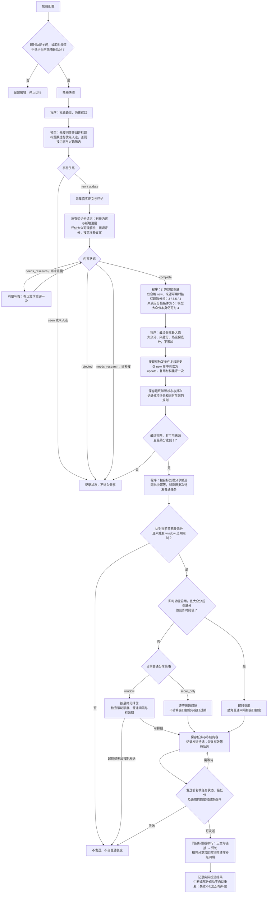

# AgentScroll 系统设计与内容规则

本文统一描述当前源码中的业务流程、内容判断、事件更新、分享决策和系统边界。配置、API、CLI、数据格式、平台支持和测试方法见[使用与接口](usage.md)。

## 业务目标

AgentScroll 让 AI 持续了解近期真实发生的热点、新闻、知识和网络表达，为自然聊天储备背景，也主动分享突发新闻、好玩和抽象的内容。判断同时考虑实时性、趣味性和高频运行成本。

材料应来自实际读到的正文或评论，但不要求官方来源或完整精确的新闻结论。知道谁大致发生了什么、梗或笑点在哪里即可；未确认消息保留“网传”“帖子称”等限定，不能把推断写成事实。

能用本地规则完成的去重、阈值比较、分数组合和调度由程序处理；内容语义、事件关系和分享价值交给模型。限制候选量、正文规模和模型上下文，避免为同一个确定性决策增加模型请求。

## 当前处理流程

系统有两个入口：

- 主动搜索：指定主题 → 场景与平台路由 → 搜索候选 → 读取正文和评论 → 过滤、排序与压缩 → 知识文件。
- 热榜学习：热榜快照 → 标题去重 → 模型筛选与事件关系判断 → 正文采集 → 逐话题知识卡判断 → 仅对材料不足的话题补搜 → 暂定分享决策 → 必要的历史复核 → 保存最终知识与分享批次 → 按目标调度发送。

标题筛选使用一次模型请求；每个话题在原有知识卡请求中同时完成内容状态、大众可理解性、两项评分以及文案和评论选择。补搜后的话题使用补搜知识卡请求；更新话题的其他历史候选直接放入原知识卡请求；待分享新事件命中历史时进行单话题重评，候选接近时先判断事件关系。热度保底、分数合并和发送策略本身不调用模型。

热榜学习周期、普通分享窗口和消息发送间隔各自承担不同职责：学习周期决定何时取新材料，分享窗口限制普通消息数量，发送间隔控制消息到达节奏。

## 热榜学习

### 拉取与去重

未指定业务类别时使用“综合”组，依次包含微博、虎扑、百度贴吧和知乎。拉榜只生成索引，不读取正文和评论。

不同榜单按 Source ID 和榜单排名保留先出现的条目，再按 URL 或标题全局去重。URL 规范化统一协议和域名大小写、移除 fragment 并保留 query；标题规范化统一 Unicode 兼容字符、大小写和连续空白。平台目录和快照格式见[NewsNow 热榜](usage.md#newsnow-热榜)。

筛选前排除近期已分析过的完全相同标题；没有新标题时跳过模型请求。标题缓存窗口为快照日期及其之前共 7 个自然日，精确命中也会刷新最后出现时间。缓存表示“已经分析过”，不表示形成知识卡或实际分享过。

第一轮结果成功校验后，本轮标题写入缓存，包括入选、未入选和确认重复的标题。无法合法关联历史、且因话题容量不足而延后处理的条目不标记为已分析，留待后续运行。

### 第一轮筛选

模型只根据当前标题与程序提供的历史标题筛选，不打开 URL，不搜索，也不依赖输入之外的事实。最多选 15 个话题，不凑满数量，不要求类别均衡。每个话题选择一个主要类别：

- `news`：近期发生或仍有明确进展、具有现实公共价值的新闻与变化。
- `fun`：新词、固定表达、梗、反差、抽象、荒诞或有趣内容；影视宣传和明星宣传不属于此类。

第一轮复用现有模型请求，先按标题中的事件主体判断用户黑名单。主体直接属于不喜欢的内容时，整个话题排除，不进入正文采集、知识卡或分享，也不作为历史重复事件返回；仅顺带提及、同名或无法明确判断时不据此排除。黑名单优先于兴趣、热度、大众价值和趣味；剩余话题再按下文规则筛选。关键词按语义匹配，不依赖原文包含关系；配置方式见[配置参考](usage.md#环境与配置)。

可豁免黑名单由模型按标题语义标记，不参与模型的入选或丢弃判断；程序在历史关系校验后执行过滤：命中的新事件只要当前标题数可获得任一非零热度保底档位，就保留进入正文核验，不因该黑名单被淘汰；已确认没有新进展的事件仍按 seen 处理，其余命中话题丢弃且不标记为看过。程序直接调用现有热度评分函数判定豁免，后续评分与分享准入规则不变。无条件黑名单始终优先。

通过黑名单筛选后，先识别当前候选中的同事件标题组，再决定入选。同事件标题数达到配置门槛时，优先进入正文采集，不因日常、宣传、含义不明、依赖圈内背景或暂时看不出公共价值而在标题阶段淘汰；不属于 fun 的话题暂按 news 核验。只统计当前候选中的代表标题与关联标题，不计历史召回，也不合并不同事件凑数。门槛由程序从配置填入提示词模板，不作为单独的 JSON 输入字段。

未达门槛的话题仍按内容和兴趣价值筛选。已确认没有新进展的历史事件仍按 seen 跳过；最多 15 个话题的容量不变。热度达标话题优先，其余按内容价值和兴趣相关性选择。热度入选只获得采集机会，不豁免后续知识卡和分享判断。

兴趣与类别正交，不增加第三种类别，也不占固定名额。关键词可以表示人物、产品或领域，模型判断标题是否直接相关，并保留候选关键词供知识卡阶段使用。领域内有具体变化的内容即使受众较窄也可选入；兴趣用户可被视为熟悉该领域及其术语和圈内梗。普通宣传、常规动态、旧闻、重复进展、语义不明内容或擦边提及，不能仅因兴趣相关而入选。重大新闻和高趣味内容无需命中兴趣。

普通受众的趣味判断要求能直接理解笑点；必须了解作品设定或圈内知识才能觉得有趣的内容，不凭大众趣味入选，但可以按明确命中的兴趣判断。

多个标题明确属于同一事件时合并为一个话题，关联标题不额外占名额。news 的代表标题优先简洁陈述核心事件或最新进展；fun 优先保留最能呈现原梗、反差或异常表达的原始标题。程序校验模型返回的编号，再映射回原始标题和平台。

关闭内置通用推荐后，只有明确命中兴趣或达到原有热度入选门槛的话题进入后续流程；程序也按这两个条件过滤首轮结果。news/fun 仍表示内容类型，用于原有内容核验和表达规则；模型不输出大众分享分，由程序补为 0；兴趣评分、热度保底及发送调度保持原规则。标题筛选、初次知识卡和补搜请求均直接省略关闭的大众推荐与评分规则，不通过追加忽略指令覆盖已有规则。

### 历史召回与事件关系

程序在本地召回近期可能相关的历史事件，再由第一轮模型判断关系。召回使用 `jieba` 词性分词，名词、人名、地名和机构名等词权重较高；没有共同词时才使用字符 bigram。每个当前标题最多携带 3 个历史事件候选，不额外生成摘要或 signature，也不对全部召回标题设置合计字符上限。

若当前标题与最近 6 小时的历史标题包含相同明确人物名，即使普通标题相似度不足，也优先召回该历史事件。当前提示词要求：同人物且标题没有明确指向另一件事时，优先按更新进入材料核验；标题明确指向另一事件时仍可判为新事件。

- `new`：没有合理的同事件历史候选，或明确是另一事件，进入采集。
- `update`：同一事件有疑似新进展，或属于上述需要核验的同人物情况，携带旧卡进入采集。
- `seen`：明确是同一事件且没有实质新进展，不再采集，仅刷新历史标题和出现时间。

同一历史事件可能以不同标题出现在多个候选项中；第一轮必须将指向同一历史事件的当前标题合并。历史引用必须来自本轮该话题的本地召回结果。非法 update 引用降为 new；非法 seen 引用在有容量时降为 new，没有容量时留待后续运行，诊断随批次保存。

事件关系目前在标题筛选阶段确定，知识卡模型主要核验内容与增量，不能自行把既定 update 拆成另一个新事件。由此产生的误归并风险见[当前限制](#当前限制与后续方向)。

### 正文采集

标题筛选结果先独立落盘，再开始正文采集。采集入口与代表标题分开选择，优先使用已识别的非知乎关联条目；知乎热榜标题只作为线索，不读取其正文或地址，也不能单独支持成卡。

默认以取得 3 篇去重后的可读帖子为目标；单个搜索词可以提供多篇帖子，按剩余缺口提高每次搜索的取帖数量，达到目标后停止并最多保留 3 篇。已有非知乎入口不足时，复用非知乎标题到微博补采；只有整组标题都来自知乎时，才用一次批量模型请求把各组标题转换为 2 至 3 个搜索词，再到微博找同一事件的帖子。搜索词保留能区分事件的主体与动作，去掉泛化问句，不补写标题之外的事实。

正文只接受快照日期及其之前共 7 个自然日内、发布时间可确认的帖子；同一帖子多次命中只保留一次。入口失败、日期缺失或超出范围时继续后续入口。微博补采后仍未达到采集目标，转入有限主动搜索；只有标题、搜索摘要或失效地址不算证据完整。

微博通过 `mcp-server-weibo` 定位 feed；虎扑读取帖子结构化数据；贴吧通过话题页和 Playwright 读取帖子及楼层；显式使用 B站热榜时，通过热搜标题定位视频并读取简介和评论。通用平台读取方式见[平台采集路径](#平台采集路径)。

### 知识卡与补搜

知识卡只保留事件或梗的大意和一至两个值得记住的信息点，并给出自然的聊天切入角度。各话题并发请求，结果按话题 ID 汇总；共同规则与当前类别的专用规则一起进入请求。

- `complete`：现有材料足以辨认基本事件或笑点。缺少完整经过、精确数字、原因或各方回应，不单独构成补搜理由；有知识价值但分享价值不足时仍可成卡。
- `needs_research`：未达到正文采集目标，或材料仍无法辨认基本对象和内容，需要有限补搜。单个请求失败或输出校验失败也保留为此状态并记录错误，不中断其他话题。
- `rejected`：材料足以确认内容已过时、没有近期具体进展、不符合类别要求、与标题不符，或更新材料只是重复已知信息；不生成知识，也不进入补搜和分享。

补搜只处理 `needs_research`，不重新处理完整或已淘汰的话题。news 搜微博、微信公众号和今日头条；fun 只搜微博。每个话题合计最多取得 3 条可读内容，额度在详情和评论请求前按平台顺序尽量均分，因此 news 为每个平台一条，fun 为微博三条。

补搜复用平台采集入口，沿用原来的查询日期范围；不直接使用搜索引擎摘要，也不启用模型原生 Web Search。已有材料和补搜材料都没有可读正文时，不再调用知识卡模型；仍无法辨认内容时保留待补搜状态，已有证据确认不合格时淘汰。

### 更新知识的边界

update 输入包括旧卡的当前知识、聊天语境、上次更新摘要，以及最近 7 天成功更新的标题时间线。时间线只包含成功更新的代表标题和关联标题，不包含搜索结果、证据或 seen 标题；它用于识别重复进展，不能当作事实证据。

只有材料明确支持旧卡和时间线尚未包含的新状态、新结果、新数字、新处置或新回应，才生成完整更新。初轮已确认没有新进展时直接淘汰；只有材料不足、仍无法判断时才补搜，并非所有未能成卡的更新都会补搜。

成功更新以旧知识为底稿合并当前状态：保留仍成立的核心信息，替换已过时的数字或结果，局部细节仅在仍有核心价值时保留。最新更新摘要只描述本轮新增内容。知识合并成功不等于值得再次主动分享，分享仍需独立评价增量价值。

## 即时分享

### 元规则总表

下表概括内容取舍与表达的总体倾向，具体阶段和执行条件见后面的[分享规则总表](#分享规则总表)。“要”表示优先考虑；入选采集、形成知识和主动分享分别判断。

| 维度 | 元规则 | 含义与适用边界 |
| --- | --- | --- |
| 优先内容 | 重大、有现实影响的要 | 优先近期突发、影响较多人或正在快速发展的关键变化；不要求命中兴趣关键词。 |
| 优先内容 | 好玩、有反差、抽象的要 | 优先新梗、网络表达、荒诞、猎奇和意外感；正文或评论需支持实际笑点，不能只靠标题包装。 |
| 优先内容 | 兴趣相关的要 | 直接相关且有具体变化或趣味的领域内容可优先，允许受众较窄；普通提及、同名或牵强关联不算兴趣价值，常规动态也不因此自动值得分享。 |
| 优先内容 | 明确有热度的要 | 同事件标题数达标，优先采集；标题阶段可放宽日常、宣传、含义不明、圈内背景和公共价值要求。仍跳过无新进展的重复事件；成卡和分享继续核验，热度保底只适用于合格新事件。 |
| 排除内容 | 普通日常默认不要 | 普通个人纠纷、家庭或明星日常、常规赛事与产品动态，没有具体变化、公共价值或趣味时不选；热度达标可先采集，兴趣相关仍需有实际内容价值。 |
| 排除内容 | 单纯宣传不要 | 不把宣传当作新闻价值或趣味；影视、明星宣传不属于趣味内容。热度达标可先核验，正文阶段仍按内容类别判断。 |
| 排除内容 | 受众小、大众看不懂的默认不要 | 面向大众时，受众很窄或需要圈内背景才能理解的内容不选；明确命中兴趣时可按熟悉该领域的用户判断，热度达标时可先采集核验，大众评分仍受可理解性约束，热度保底独立判断。 |
| 排除内容 | 重复的不要 | 同一事件的多条标题合并；换标题、再次上榜或重复已有回应，不等于新事件或新进展。热度和兴趣不能豁免去重。 |
| 排除内容 | 过时、没有新进展的不要 | 旧闻、旧梗回顾、长期存在却没有具体变化的议题，不因重新讨论就当作近期新内容；旧事件有真实新进展时可以更新。 |
| 排除内容 | 泛泛而谈、看不出对象的默认不要 | 缺少具体对象、变化或趣味的笼统标题通常不选；像新词或固定表达的陌生短语可以查明含义，热度达标也可先采集。材料仍不能说明在讲什么时不成卡。 |
| 判断原则 | 更新看增量 | 新进展可以更新知识，但再次分享只看新增部分是否值得告诉已知此事的人；普通数字变化、背景补充和现场细节不自动构成再次分享的理由。 |
| 判断原则 | 大众与兴趣分开评估 | 大众分享按普通人的理解和关注程度判断，兴趣分享按熟悉该领域的人判断；能看懂之后，还要判断是否值得主动分享。 |
| 判断原则 | 材料要真实，结论不强求完整精确 | 依据实际取得的正文和评论，不补造事实；能说明谁大致发生了什么、梗在哪里即可。不强求官方来源，未确认消息保留来源限定。 |
| 判断原则 | 材料不足才补搜，已明确不合格就停止 | 不为补齐日期、数字、原因或完整背景反复搜索；短正文不自动失败，评论可以补足语境。已有证据确认不合格时不靠补搜强行成卡。 |
| 判断原则 | 值得记住，不一定值得主动发 | 能成为近期谈资的内容可以只存知识；主动分享更看重此刻的影响、趣味、信息增量，以及对方是否容易关心、惊讶或接话。 |
| 表达方式 | 简短、自然、有聊天切入点 | 知识只留核心信息和使用语境；分享像真人转述，评论像自然反应，避免资料摘要、正式结论和解释式的 AI 口吻。 |
| 表达方式 | 保留原有传播力，不靠改写制造吸引力 | 新闻原标题合适时直接用，必要时才改写；趣味内容保留原标题。文案不夸大、不伪造悬念，来源要支持核心事件或笑点。 |
| 表达方式 | 自然的真实评论优先 | 有贴合话题且自然的网友评论就选用；没有合适评论才自拟。真人感优先，趣味内容再从自然反应中选最好玩的。 |
### 分享规则总表

下表汇总从标题进入系统到最终发送的全部分享相关规则，按当前实现说明适用条件、行为和限制。

| 规则项 | 现有规则 | 当前行为与边界 |
| --- | --- | --- |
| **程序：筛选前处理** | | |
| 标题去重 | 当前榜单按 URL／标题去重；近 7 个自然日已分析标题缓存 | 精确命中不重新筛选；缓存表示“分析过”，不表示成卡或分享过；没有新标题时跳过筛选模型请求 |
| **LLM：标题粗筛** | | |
| 黑名单筛选 | 先按事件主体语义排除用户不喜欢的话题 | 优先于后续所有入选规则；判断边界见[第一轮筛选](#第一轮筛选) |
| 内容筛选 | 模型先归并同事件标题，再判断是否达到配置的标题数门槛；达标优先入选，未达标按 `news`／`fun` 与兴趣价值筛选 | 达标准入的有热度话题：不因普通日常、宣传、含义不明、依赖圈内背景或暂时看不出公共价值而在标题阶段淘汰；不属于 `fun` 的暂按 `news` 进入正文核验。 容量与优先级：最多 15 个话题，不凑满；热度达标话题优先，其余按内容价值和兴趣相关性选择；同事件只占一个名额，关联标题不另占。 历史与后续：确认没有新进展仍按 `seen` 跳过；入选的 `new/update` 进入采集，热度达标不直接保证成卡或分享，仍需正文核验并满足后续规则。 |
| 兴趣筛选 | 标题明确相关时提高筛选优先级，保留候选兴趣词 | 可以接受领域动态和圈内梗，但不能仅因兴趣相关而选入重复进展、常规宣传或擦边内容；不设固定兴趣名额 |
| 事件归并 | 合并同事件标题；本地召回历史后判断 `new/update/seen` | new 和 update 进入采集，seen 跳过；同人物近期标题优先召回并倾向按 update 核验，仍可能误合并不同事件 |
| **LLM：知乎检索词转换（按需）** | | |
| 检索词生成 | 每个纯知乎话题生成 2 至 3 个检索词 | 用于其他平台搜索同一事件；不回答知乎问题，不补写事实。 |
| **程序：正文采集** | | |
| 采集材料 | 读取非知乎入口，必要时到微博补采 | 未达到采集目标的话题直接进入待补搜状态，跳过初轮知识卡请求。 |
| **LLM：初轮知识卡** | | |
| 材料判断 | `complete/needs_research/rejected` | 材料足够且合格才成卡；材料不足补搜；已确认不合格或没有新进展时淘汰；完整但分享价值不足可只存知识 |
| 大众可理解性 | 材料支持文案，普通受众能理解核心事件或笑点；fun 仅看原标题 | 此判断不代表价值高；未通过时大众分最高 2.9，但仍可按领域用户评兴趣分 |
| 大众评分 | news 看影响、增量、即时性和回应空间；fun 看实际趣味 | 最高 4 分；4 分对应重大新闻进展或格外罕见的趣味；非 complete 或没有可用来源时为 0 |
| 兴趣评分 | 按熟悉候选关键词所代表领域的用户评价分享价值 | 最高 3.9；无候选兴趣词、非 complete 或无来源时为 0；兴趣分不能独自取得即时待遇 |
| 更新评分 | update 的两项评分共同遵守增量门槛，关闭大众评分时仍约束兴趣分 | 默认最高 2.9；只有新增内容明显改变事件核心状态、结果或影响的理解，且值得再次告知已知此事的人，才可达 3 分；重大转折可得大众 4 分；程序不把所有 update 硬性封顶 |
| 文案与评论 | news 必要时改写；fun 保留原标题；评论优先自然的真人反应 | 文案须有材料支持；真实评论可来自同话题任一帖子；没有合适真实评论时才生成，产物中区分两种来源 |
| **程序：结果校验与分享计算** | | |
| 热度保底 | 合格 new 有可用来源时，按本轮同事件标题数提供分档保底，见[分档规则](#热度保底与最终分) | 可提供 3、3.5 或 4 分，不修改内容状态或模型原始评分；update 不适用；历史标题、时间线和搜索结果不计数 |
| 最终评分 | 取大众分、兴趣分、热度保底分的最大值 | 不累加；多条规则可同时生效，保留各分项和规则记录，不把程序保底记成模型高分 |
| 分享候选 | 最终分达到 3 时，必须同时有分享文案、来源和评论选择 | 低于 3 时分享对象为空；来源与真实评论编号须能在材料中回填；生成分享文案不等于实际发送 |
| **按需：有限补搜与 LLM 重评** | | |
| 有限补搜 | 只处理 needs_research，复用已有平台采集入口 | 不重做 complete 或 rejected；两轮都没有可读正文时不再调用知识卡模型；标题数达标不能豁免材料要求 |
| **按需：保存前历史复核** | | |
| 保存前历史复核 | 启用自动分享，所有已有分享内容的 complete、new 卡均本地复核正文历史 | 候选接近时由模型判断事件关系；新事件命中后改为 update、取消热度保底，重评新增价值；已有更新在原知识卡请求中比较其他历史；复用材料、不重新搜索 |
| **程序：发送调度与交付** | | |
| 发送准入 | 最终分达到当前选中策略的最低分 | 低于门槛不发送、不占普通额度；即时待遇不能绕过；即时阈值低于当前策略最低分属于配置错误，加载时报错 |
| 窗口策略 | `window`：最低分、每批择优、每目标滚动额度、有效期和普通间隔 | 普通分享受限；超出批次容量或无法在有效期内发送则丢弃，不留作后备；即时分享仍受窗口策略的过期检查约束 |
| 分数策略 | `score_only`：达到最低分，不计算窗口额度或窗口过期 | 与 window 互斥；仍遵守普通发送间隔和新批次替换规则 |
| 即时待遇 | 合格分享的大众分或已生效热度保底分达到即时阈值 | 不等待普通间隔、不占普通窗口额度、不推迟后续普通分享；关闭即时功能后全部按普通节奏；不恢复过期或已结束任务 |
| 队列替换与排序 | 按最终分降序，同分保留原顺序；新批次替换同目标旧批次待发普通分享 | 待发即时分享不因新批次被替换；已选分享失败不从低分候选补位；不同目标独立计算额度 |
| 消息交付 | 正文和链接先发，评论随后单独发；同目标整组串行 | 不插乱正文与评论；相邻两组至少一组为即时分享时保留秒级间隔；发送前复核任务、门槛及适用的额度和过期条件 |
| 幂等与恢复 | 同批次重复提交不重复建任务；任务冻结发送内容，SQLite 恢复状态 | 后续知识更新不改变待发正文；恢复有效等待任务；中断或部分发送成功标为结果不确定，不自动重发；普通任务已占额度按窗口保留 |
| 审计 | 记录模型分、热度保底分、最终分、生效规则和发送待遇 | 可同时保留大众、兴趣和热度规则；发送器不按标题数猜触发原因；成功投递视图展示实际冻结内容 |

### 决策顺序与职责

分享采用固定的阶段顺序：内容准入 → 表达与价值判断 → 热度保底 → 分享资格 → 发送调度。各阶段只处理自己的条件，不使用可配置的规则优先级列表；高分和热度不能把不合格内容改为完整，即时待遇只豁免普通限流。

内容状态、事件增量、可理解性和价值由模型判断；程序校验输出，再统一计算保底、最终分和发送待遇。模型仍在原有知识卡请求中按同一规则准备分享文案和来源，不增加评分或策略模型请求。

### 大众与兴趣评分

大众分最高为 4，兴趣分最高为 3.9；0 表示没有可分享材料或来源，正常分数最多保留一位小数。

news 的大众分综合影响范围、信息增量、即时性和回应空间。fun 的大众分评价实际趣味、反差、荒诞或意外强度，不假设接收者熟悉相关作品、角色或圈内背景。

- 1 至 2 分：内容普通、关联弱、过时或很难引发回应。
- 高于 2 且低于 3 分：有谈资，可以记住，但主动分享价值有限。
- 3 至 3.9 分：有多个明显值得主动分享的强点；news 容易引发关心或讨论，fun 让人自然想转发。
- 大众 4 分：news 为重大突发、影响广泛或快速发展的关键进展；fun 为格外罕见、明显高于普通热门内容的趣味。

兴趣分只针对标题阶段保留的候选关键词，评价熟悉该领域的用户是否值得主动知道这条内容。直接相关但属于常规变化时不因兴趣自动高分；具体、近期、值得主动知道或讨论时可达 3 至 3.9 分。没有候选兴趣关键词时兴趣分为 0。

大众可理解性只判断表达是否适合普通受众，不表示分享价值高。材料支持文案、普通人能理解核心事件或笑点，才通过此判断；fun 必须仅凭原标题判断。未通过时大众分最高为 2.9，兴趣分仍按领域用户评价。非完整状态或没有可用来源时，两项评分均为 0，也不能通过大众可理解性判断。

### 更新评分

update 的两项评分都只评价相对于旧卡的新增进展，不重新评价整件事的绝对重要性。默认最高为 2.9；新增内容明显改变核心状态、结果或影响，并值得主动告诉已经知道此事的人时，才可达到 3 分以上。大众 4 分只用于新增进展本身构成重大转折或产生广泛影响。

普通数字变化、原因或背景补充、现场细节和重复回应不能达到主动分享档；兴趣相关性和标题热度不能改变这条要求。update 仍可能获得高分和即时待遇，但必须来自新增进展本身。

这些语义判断由模型完成；程序不会把所有 update 硬性封顶到某个分数。事件被错误归并为 update 时，也会按该关系评分，见[当前限制](#当前限制与后续方向)。

### 热度保底与最终分

热度保底只适用于最终关系为 new、状态完整且有可用来源的话题。令 T 为配置的标题数门槛，n 为本轮同事件标题数，由程序按以下顺序计算：

| 标题数条件 | 热度保底分 |
| --- | --- |
| n ≥ T | 4 |
| n = T − 1，且 n ≥ 2 | 3.5 |
| n = T − 2，且 n ≥ 2 | 3 |
| 其他情况 | 0，不提供保底 |

默认 T=3 时，至少 3 条给 4 分，2 条给 3.5 分，1 条不保底；T=1 时，单条已达到最高档门槛，仍给 4 分。第一轮热度优先入选仍要求标题数达到 T；较低保底档只作用于已经入选、完成正文核验的话题。

热度保底分达到当前发送策略最低分的话题，在原有知识卡请求中准备分享文案；其他话题仅在两项模型评分的最大值达到该最低分时生成文案。不增加模型请求，也不向模型传入热度分档参数。

标题数仅包含当前热榜快照中第一轮合并出的代表标题和关联标题；不包括历史召回、已有时间线或主动搜索结果。update 即使再次有多个标题上榜，也不取得保底。热度不改变内容状态和两项模型评分。

最终分享分取大众分、兴趣分和热度保底分的最大值，不累加。最终分达到当前发送策略最低分才生成分享候选；模型必须同时提供可用文案、来源和评论选择，程序按实际证据校验。低于门槛时只保留知识卡，不生成分享对象。

文案生成、结果校验与发送资格判断复用当前发送策略的最低分；实际发送仍受窗口配额和发送间隔约束。配置的即时阈值不得低于当前所选策略的最低分，否则加载配置时报错。

生效规则允许同时记录大众、兴趣和热度，不强行只选一个原因。发送器读取已计算的分数与保底，不根据标题数重新猜原因。具体配置与审计字段见[自动分享参考](usage.md#astrbot-im-自动分享)。

### 分享文案、来源与评论

news 的原标题准确、自洽且有吸引力时直接使用；标题含义不明、问句过长或容易误导时才改写。删除“如何评价”等不提供事件信息的问句，承载核心信息的问句可以保留。改写保留有传播力的真实表达，只补一个材料支持的关键信息点，不写成新闻摘要。

fun 直接使用原标题，不改写或补充。两类文案都不能伪造悬念、夸大材料或隐去改变内容性质的关键事实。

来源应支持分享文案：news 优先直接、完整支持核心事件和最新进展的内容；fun 优先能呈现标题笑点、反差或抽象之处的内容。不为了一条好评论选择跑题的来源。

评论优先真人感，应像普通人自然说出的口语反应。news 选择贴合分享角度的自然反应；fun 在自然的候选中选择最好玩、最能接住笑点的评论。存在不明显跑题且自然的真实评论时优先使用，不因短、口语化或信息量少而改写；都不合适时才生成一句自然反应。

真实评论可以来自同一话题的任一已采集帖子，不要求与分享链接属于同一帖子。模型返回来源和评论的本地编号，程序回填 URL 和原文；所选评论含可识别的方括号表情时，模型另返回仅将表情转为对应或语气相近 emoji 的完整评论用于展示，保留重复次数和其他文字，普通方括号内容及无法识别的表情保持原样；生成评论与平台评论在产物中区分。review 文本中的“网友评论”“我的评论”标签仅供检查，实际发送不加前缀。

### 保存前的历史复核

知识卡和分享分在最终落库前仍是暂定结果。启用自动分享时，所有已有分享内容的 complete、new 卡均触发正文历史复核，包括兴趣分入选和未达到即时阈值的分享。

复核使用已采集正文和来源标题，在最近 7 天同类别完整历史事件的标题、当前知识和最新进展中做本地高置信匹配。最佳候选须达到历史信息覆盖和共同关键词门槛。最佳候选明显高于次优候选时直接匹配；候选接近时，将分差范围内最多三条候选的标题、知识和最新进展，以及当前知识摘要、新增进展和分享文案交给模型判断是否同一事件或已覆盖拟分享事实。允许同时确认多条历史，不能因历史重复记录导致候选分差小就按新事件放行。

新事件未召回候选，或模型确认既非同一事件也未覆盖拟分享事实时保留结果；命中时改为 update、附上旧卡和时间线，并参考其他已确认历史中覆盖的内容，复用已有材料只重评该话题一次，不重新搜索。此时热度保底失效，以重评结果替换暂定结果。事件关系判断失败或重评失败保留为待补搜状态，不回退发送首次结果。

已有 update 在生成知识卡前用本地规则召回其他历史，排除原事件，保留原事件归属、旧卡和时间线。未达到全文高置信匹配门槛时，补充检查正文是否覆盖其他历史标题，沿用覆盖率门槛并要求至少两个共同的高权重词。最多附上三条候选的标题、知识和最新进展，由原本的知识卡请求同时判断候选是否相关、事实是否重复以及新增价值。仅同领域、同人物或背景关联的候选不能作为重复依据；多个拟分享事实分别已被不同历史覆盖时也属于重复。若需要补搜，利用新材料重新本地召回，交给原有补搜知识卡请求判断。这项更新去重不额外调用模型，只增加候选摘要输入。

最终知识状态和分享批次在补搜及必要复核完成后统一保存一次，避免把中间结果送出。保存前的额外模型复核仅用于启用自动分享时的待分享新事件。

### 发送策略与队列

定时热榜进程把最终分享批次交给平台无关的分发器。各目标独立计算资格、额度和到期时间；最终分决定排序，同分保留原候选顺序。

两种普通分享策略互斥，只使用当前选中的一种：

- 窗口策略：先过滤低于最低分的候选；普通分享每批只保留最高分的指定条数，再按每个目标的滚动窗口额度与普通间隔排期。超出批次容量或无法在有效期内发送的候选丢弃，不占额度，也不留作后备。
- 分数策略：达到最低分就合格，不使用窗口额度和窗口过期限制，但仍遵守普通发送间隔。

合格分享的大众分或已生效热度保底分达到即时阈值时，获得即时待遇。兴趣分不能独自触发即时；关闭即时功能后，所有合格分享都按普通节奏处理。

即时分享不等待普通间隔、不占普通窗口额度，也不推迟后续普通分享；窗口策略下仍受批次过期检查约束。低分、过期、已取消或已经结束的任务，不会因即时待遇重新生效。

新批次替换同目标上一批尚未发送的普通分享，两种策略均如此；等待中的即时分享不因此被替换。某个已选分享失败后，不从低分候选中补位。同一分享批次重复提交不会重复创建任务。

### 消息交付与恢复

每个分享先发送正文与链接，再单独发送评论。同一目标的整组消息串行执行，不让其他分享插入正文和评论之间；不同目标可以并行。相邻两组中至少一组为即时分享时，按配置保留秒级间隔。

发送前重新检查任务状态、当前最低分，以及当前策略适用的过期和普通额度限制。实际消息读取任务创建时冻结的内容，后续知识更新不改变已经排定的正文和评论。

IM transport 只负责发送已经编排好的消息，不读取 review 批次、不判断评分、不维护限流。当前 AstrBot transport 通过 OpenAPI 转发到配置的会话；接入其他平台复用相同分发器。

重启后恢复仍有效的等待任务，目标已移除或按当前策略已过期的任务不再发送。中断时处于发送中的任务标为结果不确定，不自动重发；普通任务的已占用额度按窗口保留。整组只成功发送一部分时也标为结果不确定，避免把部分成功误记为整组成功。

## 主动搜索

### 场景路由

主题搜索支持三种场景：

- `formal`：面向公告、政策、报告、研究、新闻进展和正式分析，优先使用知乎、微信公众号和今日头条。
- `informal`：面向网络梗、流行语、二创、吐槽和评论区语境，默认使用微博、B站和抖音。小红书当前不进入默认路由，但仍可显式指定。
- `auto`：根据查询意图选择路线；没有明显信号的短主题词优先发现非正式语境，较长且信息明确的查询优先走正式场景。

用户显式指定平台时，以指定平台为准，不再应用默认场景路由。“正式”和“非正式”描述内容形态，不代表来源可信度；自媒体内容、未确认消息和网友说法仍需保留来源限定。

### 搜索规模

`quick`、`default` 和 `deep` 分别把每个平台的候选上限设为 5、10 和 20。B站对应最多搜索一、二、三页；小红书在 `quick` 模式使用公开索引发现候选，在 `default` 和 `deep` 模式优先使用 Playwright。其他平台沿用各自采集路径并按档位调整候选规模。

无论选择哪一档，命中的候选都会继续读取正文；支持评论采集的平台还会读取评论。同一平台的详情请求按配置区间限速，不同平台可以并发。

### 内容读取

搜索结果只是候选入口。候选必须继续读取详情，获得真实正文或发布文案；需要评论时还要读取真实评论。

只有摘要、正文为空、正文过短或缺少有效原文地址的候选不进入最终知识。视频平台的正文指发布者文案或完整简介，不包含自动推断的字幕和音视频转写。

微博、小红书、B站、抖音、微信公众号和今日头条只保留成功读取到正文或发布文案的条目。统一详情校验要求正文去除首尾空白后至少有 2 个字符，并且正文类型、解析来源和正文地址有效；详情受阻、只有摘要或正文为空的候选会被丢弃。微信公众号和今日头条使用通用文章提取器时，可识别的正文块至少需要 40 个字符；未命中正文块时，段落兜底结果至少需要 80 个字符。知乎文章和回答的详情正文少于 20 个字符时视为不可读。支持评论采集的平台按配置上限保留有文字的评论，且不保存评论作者。

### 平台采集路径

以下描述的是当前代码中的读取路径，不等同于本轮已经验证平台在线可用：

- 微博：`mcp-server-weibo` 获取访客 Cookie；正文通过 MCP 单帖详情读取，评论通过微博评论 API 读取。
- 小红书：Playwright/XHR 与站外 URL 发现；正文优先读取页面初始状态中的笔记描述，专用正文 DOM 作为后备；评论从详情页签名响应提取。
- B站：公开搜索 API 与 Playwright 兜底；视频详情 API 读取完整简介，reply API 读取评论。
- 知乎：站外发现公开 URL，随后用 Playwright 读取正文，并按内容类型访问评论 API。
- 抖音：Playwright 与站外 URL 发现；正文读取分享页路由数据，专用正文 DOM 作为后备；评论从移动分享评论 API 提取。公开分享页出现 WAF challenge 时使用移动 Chromium 完成挑战并读取路由数据，不退回到 meta description。
- 微信公众号：搜狗微信搜索后访问文章页，只读取文章正文，不读取精选留言。
- 今日头条：服务端搜索页、热榜与站外 URL 发现；正文来自移动详情页或来源页，评论来自文章页签名响应。

### 知识沉淀

一次搜索把不同平台的有效内容合并成一份可追溯元数据和一份面向模型的紧凑知识文本。

- 每条内容保留平台、发布时间、正文、原文 URL、非零互动量和最多 10 个标签。
- 正文按配置上限保留；换行压缩为空格，超长内容按段落或句子边界截断并标明原始字符数。
- 评论去重后按点赞数降序保留最多 10 条；同赞数保持平台原顺序。
- 已知发布时间的内容按时间升序排列；无法确定时间的内容放在已知日期内容之前。
- 作者、平台内部 ID、图片、相关性解释、抓取状态、解析路径和 DOM 证据不写入 TXT。
- 正文为空或没有有效原文 URL 的条目不进入知识文件；微博的“图片评论”“转发微博”等无正文占位评论会被过滤。

具体文件、返回字段和可调上限见[返回值与知识文件](usage.md#返回值与知识文件)。

## 技术边界与状态

### 模块依赖

collector 负责搜索、正文和评论读取及采集产物，不依赖模型运行时；prompts 只保存提示词，不执行 I/O；workflows 组合采集、推理、校验和状态保存；sharing 统一处理分享决策与调度；integrations 负责具体平台传输。

### 运行产物

跨轮次业务状态统一保存于 SQLite：标题缓存表示分析历史，热点记录表示稳定事件及当前有效知识，分享任务表示按目标的投递状态。review 文件和日志用于检查，不承担生产状态恢复。热点记录可以长期保留，只有近期标题参与历史召回。

new 在最终结果确定后创建热点记录；update 复用同一记录。成功更新替换当前知识和最新进展，并追加成功更新时间线；失败或被淘汰的更新只记录本轮结果，保留原有效知识。标题别名与成功更新时间线分开维护，最终分享文案和实际使用的来源标题只作为后续召回别名。

同一事件是否已形成知识，与某个接收目标是否实际收到分享不是同一状态。当前更新评分统一参考旧知识，不按目标的最后一次成功分享内容重新评价增量。

原始证据、采集尝试、筛选结果、知识卡和分享批次按轮次保存。数据转换默认新建文件，不覆盖输入；关联 JSON、TXT 和分享产物保持可对应关系。目录及文件格式见[运行产物](usage.md#运行产物)，推理请求和原始响应的检查方式见[推理审计日志](usage.md#推理审计日志)。

### 推理代码维护

`agentscroll/inference/` 是从 WeClone 推理模块同步到本仓库的源码快照，使用 AgentScroll 不需要额外克隆 WeClone。

同步由 `.github/workflows/sync-weclone-inference.yml` 负责，只在 GitHub Actions 中手动触发。`__init__.py`、`audit.py` 和 `llm_client.py` 是本仓库保留的通用推理基础设施覆盖层，`online_infer.py` 不再同步；其余文件检测到上游变化时更新快照并创建 PR。

## 当前限制与后续方向

- 事件归并仍依赖标题召回和同人物优先更新规则，可能把同人物的不同比赛或不同事件放入同一历史记录。知识卡不会自行拆分这类 update；误归并后，独立的新事件也会受到增量评分和不适用热度保底的约束。区分具体事件边界的修正尚未实现。
- 正文历史复核只覆盖符合即时条件的暂定 new 卡，没有与分享开关和即时阈值解耦；其他话题仍可能因标题省略或换一种表述而漏匹配。
- 每张卡独立评分，同批其他候选不可见；分享资格和排序依赖模型分数，不能保证不同请求间完全一致。当前没有额外的批内联合评分请求。
- 聚类与完整时序统计、完整兴趣建模、日报或 Briefing 属于后续方向。目标链路是在采集、统一格式和持久化后，进一步进行聚类、时序统计、兴趣过滤与 Top-K，再补充材料并汇总输出；这些规划不代表当前已经实现。
